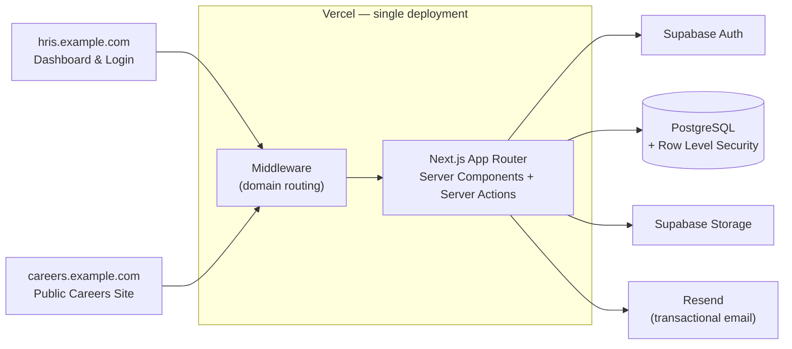
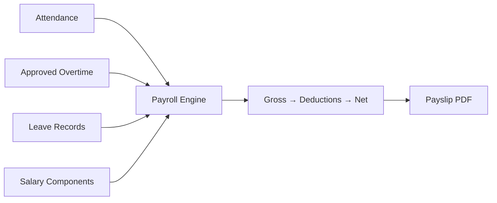
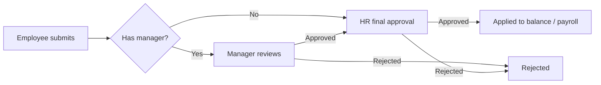

<div align="center">

# 🏢 HRIS — Human Resource Information System

**A full-stack HR platform covering the entire employee lifecycle — from recruitment to payroll.**


[](https://github.com/YOUR_USERNAME/hris/actions)

[Features](#-features) · [Getting Started](#-getting-started)

</div>

---

## ✨ Overview

HRIS is an end-to-end HR management system built for a growing company. It handles everything an HR team needs day to day:

```
Recruitment → Employee → Attendance → Leave → Overtime → Payroll → Payslip
```

It supports **three roles** — HR, Manager, and Employee — each with a tailored dashboard and strictly scoped data access enforced **at the database level** through Row Level Security.

---

## 🚀 Features

### 👥 Employee Management

- Full CRUD for employee records with search, sort, and pagination
- Organization structure: **Department → Position → Employee**, with manager hierarchy
- Profile photos and private document storage (ID, contracts, certificates) with signed, expiring download links
- Self-service **My Profile** page — employees update their own contact info; sensitive fields are protected by database triggers

### 🕒 Attendance

- Check-in / check-out with **browser geolocation**
- Automatic late detection and working-minutes calculation (Asia/Jakarta timezone-safe)
- Personal history with monthly filter, team view for managers, company-wide **daily & monthly reports** for HR
- **Attendance corrections** with approval workflow — approved corrections automatically recalculate status and late minutes

### 🌴 Leave & ⏱ Overtime

- Leave requests with **per-type balances** (annual, sick, marriage, etc.) and business-day calculation
- Overtime requests with automatic hour calculation
- **Two-tier approval** (Manager → HR) with automatic escalation to HR when the requester has no manager
- Pending queue and full approval history, each with search, sort, and pagination
- Approved leave automatically marks attendance as `leave` so it isn't counted as absence in payroll

### 💰 Payroll

- One-click payroll generation per period: **basic + allowances + overtime − deductions**
- **HR-configurable salary components** — no code changes needed:
  - Fixed amount
  - Percentage of basic salary
  - Percentage of daily rate (per late occurrence)
  - Percentage of daily rate (per absent day)
- Status workflow: `Draft → Calculated → Reviewed → Approved → Paid`
- Manual per-employee adjustment (bonus, allowance/deduction items) before finalizing
- Employee **payslips as downloadable PDFs**, available only once a period is approved

### 🎯 Recruitment

- **Public careers site** on its own subdomain — candidates browse vacancies and apply with a CV upload, no login required
- HR vacancy management (Draft → Published → Closed → Archived)
- Candidate pipeline: `Applied → Screening → Interview → Technical Test → Offering → Hired / Rejected`
- **Automated emails** at every stage, with **HR-editable templates** and dynamic variables (`{{candidate_name}}`, `{{interview_date}}`, `{{interview_link}}`, …)
- One-click **convert candidate to employee** — automatically sends an account invite

### 📊 Role-based Dashboards

| Role         | What they see                                                            |
| ------------ | ------------------------------------------------------------------------ |
| **HR**       | Total headcount, present / late / absent today, pending leave & overtime |
| **Manager**  | Team size, team attendance today, items awaiting approval                |
| **Employee** | Today's status, remaining leave balance, own pending requests            |

---

## 🧱 Tech Stack

| Layer          | Technology                                                                       |
| -------------- | -------------------------------------------------------------------------------- |
| **Framework**  | Next.js (App Router, Server Components, Server Actions)                          |
| **Language**   | TypeScript                                                                       |
| **Database**   | Supabase PostgreSQL                                                              |
| **Auth**       | Supabase Auth (invite-only, no public sign-up)                                   |
| **Storage**    | Supabase Storage (public bucket for photos, private buckets for documents & CVs) |
| **Styling**    | Tailwind CSS + shadcn/ui                                                         |
| **Validation** | Zod                                                                              |
| **PDF**        | @react-pdf/renderer                                                              |
| **Email**      | Resend                                                                           |
| **Testing**    | Vitest                                                                           |
| **CI/CD**      | GitHub Actions + Vercel                                                          |

---

## 🏗 Architecture



### Payroll flow



### Approval flow



---

## 🔐 Security Model

Security is enforced **in the database**, not just the UI:

- **Row Level Security** on every table — employees see only their own data, managers see their team, HR sees everything
- `SECURITY DEFINER` helper functions (`is_hr()`, `get_user_role()`, `get_my_employee_id()`, …) avoid recursive policy evaluation
- **Database triggers** prevent non-HR users from modifying sensitive columns (salary, role, department) even via direct API calls
- **Invite-only accounts** — public sign-up is disabled; accounts are created by HR through the Admin API
- Private storage buckets with **signed URLs** that expire after 60 seconds
- Public endpoints (careers) are restricted to `INSERT`-only with enforced initial status

---

## ⚡ Performance Notes

- **Eliminated N+1 queries** in payroll generation — ~430 round-trips reduced to ~7 by batching and using aggregation RPCs
- **Parallel data fetching** with `Promise.all` on all dashboards
- **Database aggregation via RPC** (`get_monthly_attendance_summary`, `get_monthly_overtime_summary`) instead of pulling raw rows — also sidesteps PostgREST's 1,000-row default limit
- Targeted **indexes** on frequently filtered columns (`employee_id + date`, `manager_id`, `status`, …)

---

## 🧪 Testing

Unit tests cover the logic where mistakes are most costly:

- Payroll calculation (overtime, percentage & fixed components, late/absent deductions)
- Business-day and date-range utilities
- Zod validation schemas
- Server actions (leave, overtime, approval flows) using a lightweight Supabase mock

```bash
npm run test          # run once
npm run test:watch    # watch mode
```

Every push and pull request runs **type-check → tests → production build** through GitHub Actions.

---

## 🏁 Getting Started

### Prerequisites

- Node.js 20+
- A [Supabase](https://supabase.com) project
- A [Resend](https://resend.com) account (for email notifications)

### 1. Clone & install

```bash
git clone https://github.com/YOUR_USERNAME/hris.git
cd hris
npm install --legacy-peer-deps
```

### 2. Configure environment variables

Create `.env.local`:

```env
NEXT_PUBLIC_SUPABASE_URL=https://your-project.supabase.co
NEXT_PUBLIC_SUPABASE_PUBLISHABLE_KEY=your-publishable-key
SUPABASE_SERVICE_ROLE_KEY=your-service-role-key   # server-only, never expose to the client
NEXT_PUBLIC_SITE_URL=http://localhost:3000
RESEND_API_KEY=your-resend-api-key
```

### 3. Set up the database

Apply the schema to your Supabase project (tables, RLS policies, helper functions, triggers, storage buckets). The schema covers:

`profiles` · `employees` · `departments` · `positions` · `attendance` · `attendance_corrections` · `leave_types` · `leave_balances` · `leave_requests` · `overtime_requests` · `salary_components` · `payroll_periods` · `payrolls` · `payroll_items` · `employee_documents` · `job_vacancies` · `candidates` · `email_templates`

In the Supabase dashboard, disable public sign-ups under **Authentication → Settings**.

### 4. (Optional) Seed demo data

```bash
npx tsx scripts/seed-employees.ts       # dummy employees across departments
npx tsx scripts/seed-history-data.ts    # 3 months of attendance, leave & overtime
```

### 5. Run

```bash
npm run dev
```

Open [http://localhost:3000](http://localhost:3000).

---

## 🌐 Deployment

The app deploys as **one Vercel project** serving **two domains**:

| Domain                | Purpose                    |
| --------------------- | -------------------------- |
| `hris.example.com`    | Login & internal dashboard |
| `careers.example.com` | Public careers site        |

`middleware.ts` rewrites the careers domain to the `/careers` routes and redirects any direct `/careers` access on the HRIS domain, so each page has exactly one canonical URL.

**Before going live:**

- Add all environment variables in Vercel (GitHub Secrets are separate from Vercel env vars)
- Set `NEXT_PUBLIC_SITE_URL` to the production HRIS domain
- Add the production URL to Supabase **Authentication → URL Configuration**
- Verify your sending domain in Resend (SPF/DKIM) so emails don't land in spam

---

## 📁 Project Structure

```
src/
├── app/
│   ├── (dashboard)/        # Authenticated app: employees, attendance, leave, payroll, ...
│   ├── careers/            # Public careers site
│   ├── auth/callback/      # Invite / password-setup handling
│   ├── api/payslip/        # Payslip PDF endpoint
│   └── login/
├── components/             # UI by domain (employees, attendance, payroll, recruitment, ...)
├── contexts/               # Profile context (role-aware UI)
├── lib/
│   ├── actions/            # Server actions (+ tests)
│   ├── validations/        # Zod schemas (+ tests)
│   ├── utils/              # Payroll engine, date helpers (+ tests)
│   ├── email/              # Resend client & templating
│   ├── pdf/                # Payslip document
│   └── supabase/           # Browser / server / admin clients
└── test-utils/             # Supabase mock for action tests
```

---

## 🎓 What I Learned

- Designing **RLS policies** that stay correct _and_ avoid infinite recursion
- Why "it works in the UI" isn't security — and how to enforce rules in the database itself
- Spotting and removing **N+1 query** patterns, and moving aggregation into Postgres
- Writing **testable business logic** by separating pure calculation from data access
- Setting up **CI/CD**, multi-domain deployment, and transactional email deliverability (SPF/DKIM)

---

## 🗺 Roadmap

- [ ] Interview scheduling & calendar integration
- [ ] Performance reviews
- [ ] Reimbursement module
- [ ] HR analytics dashboard with charts
- [ ] Tax calculation following official PPh 21 / BPJS regulations
- [ ] In-app and email notifications for approvals
- [ ] Audit log for sensitive changes

> **Note:** Payroll deductions (BPJS, PPh 21) use simplified configurable rates for demonstration. A production deployment should implement the official regulatory formulas.

---

## 📄 License

This project is licensed under the [MIT License](LICENSE).

---

<div align="center">

**Built by [YOUR NAME](https://github.com/YOUR_USERNAME)**

⭐ If you find this project useful, consider giving it a star!

</div>
